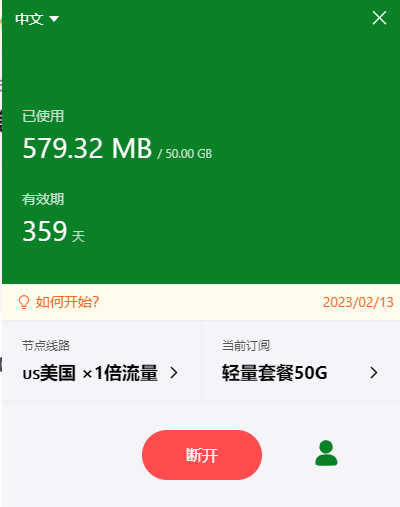
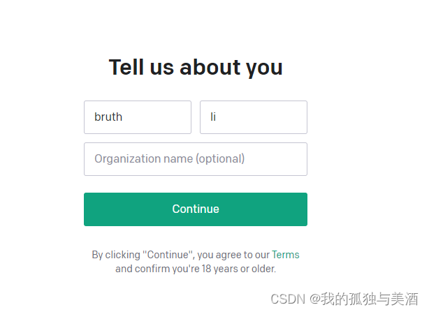
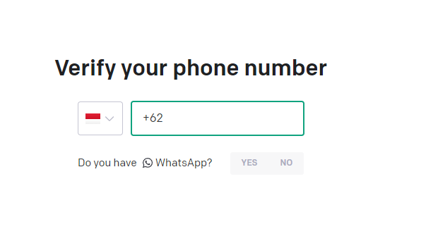
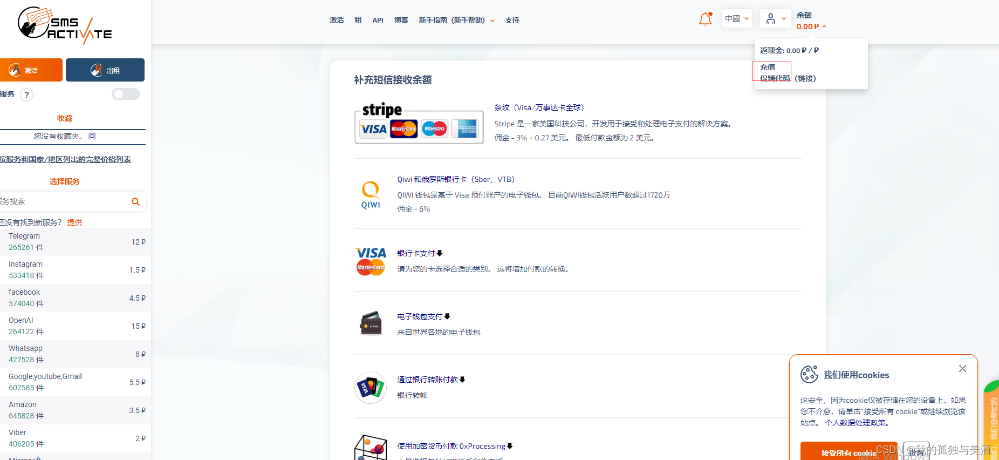
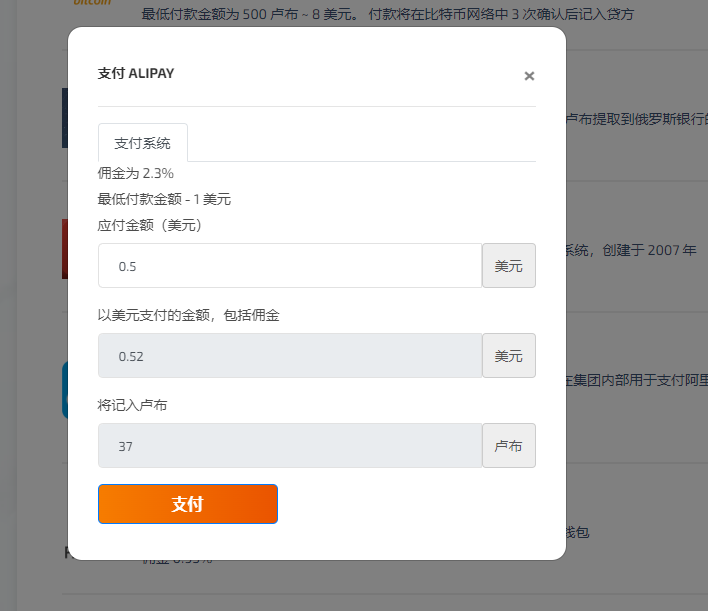
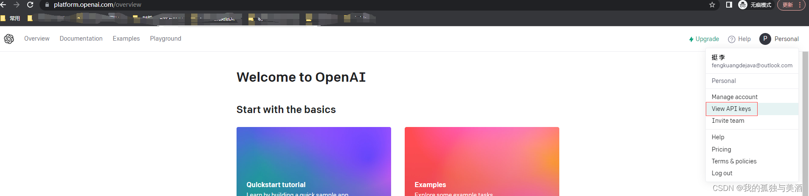
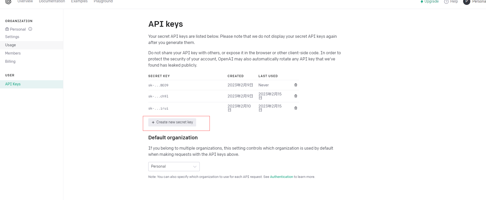
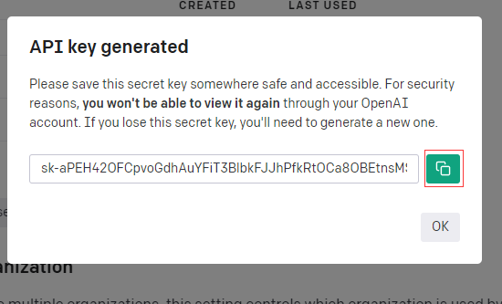

ChatGPT个人小助手应用搭建

# ChatGPT在线个人小助手应用搭建

## 在线体验
[点我在线体验](http://124.220.38.75/)

```
因为openAI账户申请后会默认有18美元的账户,
openAI每次调用大概会花掉0.01美元,
所以为了防止恶意刷api,无意义聊天,
页面做了密码限制,如果密码不对,是不会启用openAI智能回复的.
```

```
代码此文就不讲解了,源码面前,了无秘密.
后端:https://gitee.com/fengkuangdejava/chatGpt.git
前端:https://gitee.com/fengkuangdejava/chat-view.git
```

## 快速部署
### 环境准备(cenos云服务一台)

```sh
	#cenos云服务一台 其它linux系统也行 只是此处命令使用了yum,其它系统可能不一样
	yum install -y unzip nginx java-1.8.0-openjdk* dos2unix
	service nginx start
```


### 部署后端
```sh
# 安装后端服务
wget http://124.220.38.75:8080/monkey-chat-0.0.1-SNAPSHOT.tar.gz
tar -zxvf monkey-chat-0.0.1-SNAPSHOT.tar.gz
# 修改monkey-chat/application-dev.yml配置文件中的token为自己的token,如果没有token,下面会说如果获取token
dos2unix */*.sh&&dos2unix */*/*.sh
sh monkey-chat/deploy-tar.sh
#查看项目启动日志,部署成功
tail -f /var/logs/ai-chat/dev/info.log
#重启 
nohup sh /opt/java/chat-gpt-java/monkey-chat/bin/tar-service.sh restart >/dev/null 2>&1 &

#其它说明
#项目日志目录
/var/logs/ai-chat/dev/
#项目配置目录
/opt/java/chat-gpt-java/monkey-chat/conf
#项目启动文件
/opt/java/chat-gpt-java/monkey-chat/bin
#项目启动命令
#启动
nohup sh /opt/java/chat-gpt-java/monkey-chat/bin/tar-service.sh start >/dev/null 2>&1 &
#停止
nohup sh /opt/java/chat-gpt-java/monkey-chat/bin/tar-service.sh stop >/dev/null 2>&1 &
#重启
nohup sh /opt/java/chat-gpt-java/monkey-chat/bin/tar-service.sh restart >/dev/null 2>&1 &
```
### 部署前端

```sh
# 获取前端资源包并部署
mkdir -p /opt/chat-web/chat-view
wget -P /opt/chat-web/chat-view/ http://124.220.38.75:8080/dist.zip
unzip -d /opt/chat-web/chat-view/ /opt/chat-web/chat-view/dist.zip

# !!! 以下看情况执行!!!
## 后端服务没换端口的情况下 替换ip 把文件中的公网ip 替换成你自己的后台服务的域名或者ip
cd /opt/chat-web/chat-view&&sed -i "s/124.220.38.75/公网ip/g" `find . -type f -name "*.js"` >/dev/null 2>&1
## 后端服务换了端口的情况下 替换ip+端口 把文件中的公网ip 替换成你自己的后台服务的域名或者ip+端口
cd /opt/chat-web/chat-view&&sed -i "s/124.220.38.75:8079/公网ip:端口/g" `find . -type f -name "*.js"` >/dev/null 2>&1
# 开启nginx 此处已默认的nginx配置文件目录为例,有的nginx配置文件目录不在/etc/nginx/conf.d
wget -P /etc/nginx/conf.d/ http://124.220.38.75:8080/8080.conf
# 默认是8080 如果冲突 请修改/etc/nginx/conf.d/8080.conf文件的内部配置的端口和当前文件名
service nginx reload

# 检查公网是否开通端口 8097,8080.
# 然后尝试访问
http://你的公网ip:8080/
```
## Token获取
#### 准备账户
	准备google账户或者微软账户或者outlook邮箱.用于注册openAI.
	为什么需要outlook邮箱?因为国内的邮箱收不到openAI的注册邮件.
#### 搭建梯子(有梯子的跳过)

```
进入https://honghai.org/#/register?code=Kj0ZiXZu
注册账号并下载安装代理客户端(新用户免费体验100M流量)
选择 非香港,非台湾节点连接(建议美国,加拿大等节点)
```


#### 注册openAI

```
需要一个能够无痕浏览的浏览器,推荐 google.
1.打开无痕浏览模式(因为openAI不对中国开放)
2.访问https://openai.com/api/
3.点击sign up
```


```
	我选择了google账户注册,授权后补充个人信息,点击continue进入手机校验页面
```




```
 接下来需要购买一个国外的电话号码填入并验证了.
 访问https://sms-activate.org/
 注册一个账户并登录
```


```
点击余额->充值->选择支付宝充值,OpenAI印度尼西亚的手机号大概30卢布,所以需要充值0.5美元
```



```
接下来回到首页->搜索openAI,选择印度尼西亚的商品,点击购物车图标购买号码.
```


```
购买后会跳转到订单详情页,出现一个电话号码,
然后点击复制该号码
粘贴填入openAI的手机验证页并去掉62前缀.
do you have what's app 选择no ,
选择 send sms.
然后稍等一会儿回到sms-activate的订单详情页,会出现该手机的验证码(没有验证码或者取消订单不会收费,可以重新购买,重新填)
将该验证码填入openAI验证码页.
由此注册完成.
继续无痕访问https://openai.com/api/,如果未登录,则以你注册的方式登录.
按下图所示操作,生成,复制token
```




